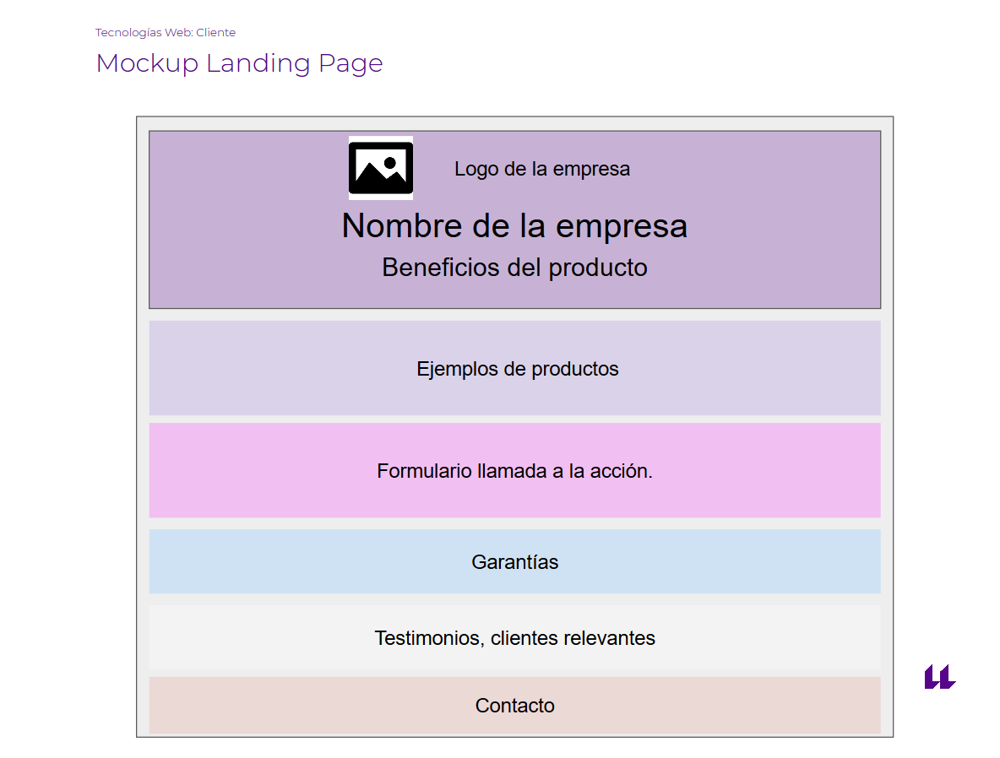

# Ejercicio Sass:
En este ejercicio se pondrá en práctica el tema 1 (Herramientas de trabajo) y el tema 2 (Introducción a Sass). Para desarrollar las tareas que se especifican, se ha creado una máquina virtual en el STIC. Se describe el proceso que deben seguir para configurarlas.
## Descripción del trabajo a realizar
En la imagen se propone una estructura para una landing page de una empresa. El objetivo es especificar los estilos utilizando Sass.

Se debe tener en cuenta las siguientes consideraciones:
- Deben definirse módulos, utilizando al menos los parciales:
    - _variables.scss
    - _mixins.scss: 
    - _base.scss: Estilos comunes, aplicables a todas las páginas del sitio.
- Definir mixins al menos para: Además se deben definir:
    - encabezados, h1
    - centrar contenido
    - estilos del form
- Anidar los estilos de los botones de form, para que se apliquen estilos específicos en el hover de ellos.
- Anidar los estilos de los elementos dentro del form, para que se resalten cuando tengan el foco.
- Utilizar el mismo estilo en los encabezados de la parte de testimonio que en la de garantías, pero con un cambio en el color de texto.
- Utilizar algún estilo de materialize sin incluir todos los estilos. Reutiliza sólo algún componenete.

## Configuración de la máquina virtual:
- Instalar nodejs
- Instalar npm
- Instalar git
- Instalar Yeoman (npm)
- Instalar el generador generator-learnfe (npm)
- Instalar Gulp (npm)
- Crear un directorio para el proyecto.
- Iniciar un proyecto básico para aprendizaje: generator-learnfe (npm)
- Iniciar el control de versiones (git)
- Iniciar el control de dependencias (npm)
- Automatizar tareas (Gulp):
    - Actualizaciones en tiempo real en el navegador.
    - Minificar css
    - Sources maps
- Instalar Ruby, ya que isntalaremos Sass como una gema de Ruby. Es decir, que Sass lo instalamos usando el administrador de paquetes de Ruby, llamado `gem`
- Instalar sass (gem) 

## Observaciones
El generator learnfe crea un proyecto muy básico, con lo esencial, para que creen ustedes el fichero `gulpfile.js` 
Pueden desplegar el proyecto como una github page.
### Utilidades:
Transpilador Sass online: (https://www.sassmeister.com/)
Codificar Front End online: (https://codepen.io/pen/)

## Extra
Descarga el código Sass del framework (https://github.com/Dogfalo/materialize/releases/download/1.0.0/materialize-src-v1.0.0.zip) Analiza el código y determina, los parciales mínimos necesarios para construir una barra de navegación.
